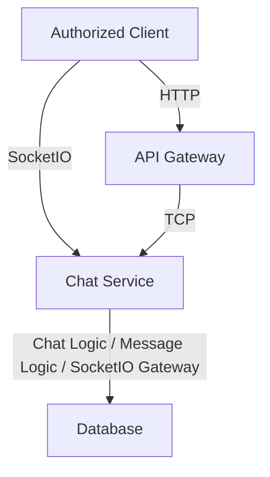
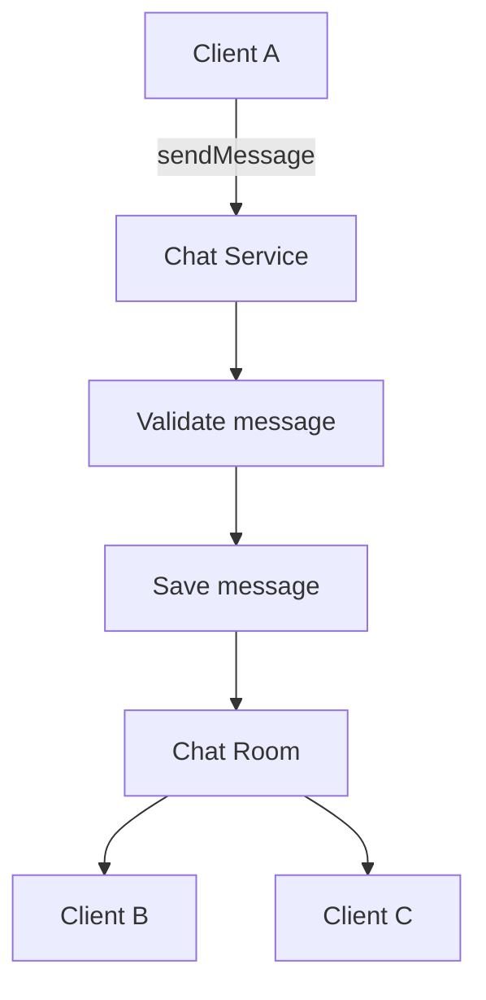

# Chat Service 
🚧 ***This service is currently under development.** Its architecture, APIs, features, and implementation details may change as development progresses.*

The Chat Service is responsible for managing chat-related functionality within the application. It communicates with the API Gateway through NestJS TCP transport and handles chat rooms, messages, and real-time communication between connected users using the [Socket.io](https://github.com/socketio/socket.IO).

## Responsibilities 
The Chat Service is responsible for:

- Manage chat rooms and participants
- Manage chat messages
- Handle Socket.IO connections and real-time communication
- Handle Socket.IO events such as joining rooms, sending messages, and leaving rooms
- Persist chat-related data
- Communicate with the API Gateway through NestJS TCP
- Handle Socket.IO connections independently from the API Gateway to isolate long-lived real-time connections and allow the Chat Service to scale independently

The Chat Service does not directly handle client-facing HTTP requests. Requests from clients are received by the API Gateway and forwarded to the Chat Service through TCP.

## Message Patterns 
The Chat Service communicates with the API Gateway using **NestJS TCP microservice transport**.

The following message patterns define the operations that can be requested by other services.

- `createRoom` 
  Currently unused.
- `chatsCreateGroup` 
  Create a group chat.
- `chatsAddGroupParticipants` 
  Add a participant to a group - `GROUP ADMIN ONLY`.
- `chatsGetRoomsByUser` 
  Fetch rooms where the user is a participant.
- `chatsSelfUpdateGroupParticipant`  
  Allow a group participant to update their own role.
- `chatsUpdateGroupParticipants`  
  Update other participants' role - `GROUP ADMIN ONLY`.
- `chatsUpdateGroup`  
  Update a group chat - `GROUP ADMIN ONLY`.
- `chatsSelfDeleteGroupParticipant` 
  Allow a group participant to delete themselves from the group.
- `chatsDeleteGroupParticipants` 
  Delete another participant - `GROUP ADMIN ONLY`.
- `chatsDeleteGroup` 
  Delete a group chat - `GROUP ADMIN ONLY`.
  
## Real-Time Events
Unlike the TCP message patterns used for inter-service communication, real-time user communication is handled through SocketIO.

For example:

