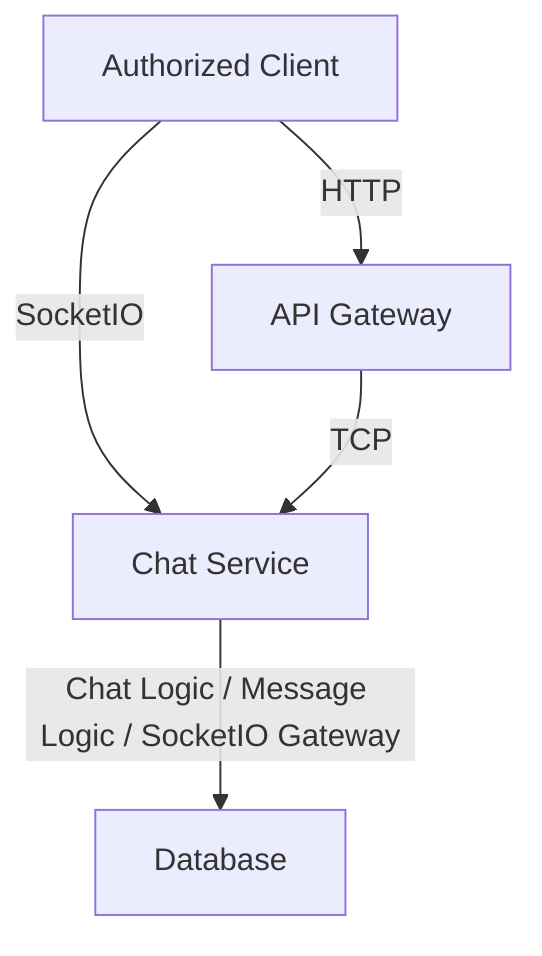
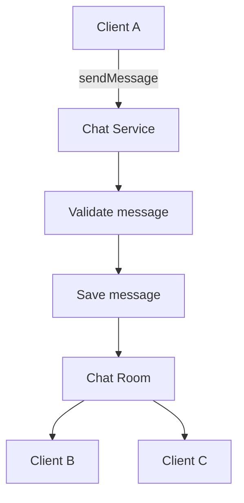

# Chat Service 
🚧 ***This service is currently under development.** Its architecture, APIs, features, and implementation details may change as development progresses.*

The Chat Service is responsible for managing chat-related functionality within the application. It communicates with the API Gateway through NestJS TCP transport and handles chat rooms, messages, and real-time communication between connected users using the [Socket.io](https://github.com/socketio/socket.IO).

## Responsibilities 
The Chat Service is responsible for:

- Manage chat rooms and participants
- Manage chat messages
- Handle Socket.IO connections and real-time communication
- Handle Socket.IO events such as joining rooms, sending messages, and leaving rooms
- Persist chat-related data
- Communicate with the API Gateway through NestJS TCP
- Handle Socket.IO connections independently from the API Gateway to isolate long-lived real-time connections and allow the Chat Service to scale independently

The Chat Service does not directly handle client-facing HTTP requests. Requests from clients are received by the API Gateway and forwarded to the Chat Service through TCP.



## Message Patterns 
The Chat Service communicates with the API Gateway using **NestJS TCP microservice transport**.

The following message patterns define the operations that can be requested by other services.

- `createRoom`<br/>
  Currently unused.
- `chatsCreateGroup`<br/>
  Create a group chat.
- `chatsAddGroupParticipants`<br/>
  Add a participant to a group - `GROUP ADMIN ONLY`.
- `chatsGetRoomsByUser`<br/>
  Fetch rooms where the user is a participant.
- `chatsSelfUpdateGroupParticipant`<br/> 
  Allow a group participant to update their own role.
- `chatsUpdateGroupParticipants`<br/> 
  Update other participants' role - `GROUP ADMIN ONLY`.
- `chatsUpdateGroup`<br/> 
  Update a group chat - `GROUP ADMIN ONLY`.
- `chatsSelfDeleteGroupParticipant`<br/>
  Allow a group participant to delete themselves from the group.
- `chatsDeleteGroupParticipants`<br/>
  Delete another participant - `GROUP ADMIN ONLY`.
- `chatsDeleteGroup`<br/>
  Delete a group chat - `GROUP ADMIN ONLY`.
  
## Real-Time Events
Unlike the TCP message patterns used for inter-service communication, real-time user communication is handled through SocketIO.

For example:


## Enviromental Variables 
Each service contains its environment variables in a .env file. The .env file should be included in .gitignore, especially when the repository is public, to prevent sensitive information or credentials from being exposed.

The Chat Service .env file contains the following variables:
```
PORT=
GATEWAY=

CHATS_SERVICE_HOST=
CHATS_SERVICE_PORT=
CHATS_SERVICE_HTTP_PORT=

MEDIA_SERVICE_HOST=
MEDIA_SERVICE_PORT=

PROJECT_URL=

TOKEN_SECRET_KEY=
TOKEN_EXPIRES=

ENVIRONMENT=

REDIS_HOST=
REDIS_PORT=

# This was inserted by `prisma init`:
# Environment variables declared in this file are NOT automatically loaded by Prisma.
# Please add `import "dotenv/config";` to your `prisma.config.ts` file, or use the Prisma CLI with Bun
# to load environment variables from .env files: https://pris.ly/prisma-config-env-vars.

# Prisma supports the native connection string format for PostgreSQL, MySQL, SQLite, SQL Server, MongoDB and CockroachDB.
# See the documentation for all the connection string options: https://pris.ly/d/connection-strings

# The following `prisma+postgres` URL is similar to the URL produced by running a local Prisma Postgres 
# server with the `prisma dev` CLI command, when not choosing any non-default ports or settings. The API key, unlike the 
# one found in a remote Prisma Postgres URL, does not contain any sensitive information.

# DATABASE_URL=
DATABASE_URL=
```

## Installation
This project uses `npm` as its package manager.

Install the project dependencies using:

```bash
npm install
```

or:

```bash
npm i
```

### Start the App
* `npm run start` — Start the app.
* `npm run start:dev` — Start the app in development mode.
* `npm run start:debug` — Start the app in debug mode with file watching.
* `npm run start:prod` — Start the app in production mode.

### Test the App
* `npm run test` — Run unit tests.
* `npm run test:watch` — Run tests in watch mode.
* `npm run test:e2e` — Run end-to-end tests.

## Project Structure 
```
├── README.md
├── blabla.ts
├── eslint.config.mjs
├── generated
│   └── prisma
│       ├── browser.ts
│       ├── client.ts
│       ├── commonInputTypes.ts
│       ├── enums.ts
│       ├── internal
│       │   ├── class.ts
│       │   ├── prismaNamespace.ts
│       │   └── prismaNamespaceBrowser.ts
│       ├── models
│       │   └── Employee.ts
│       ├── models.ts
│       └── query_engine-windows.dll.node
├── logs
│   ├── app.log
│   └── myLogFile.log
├── nest-cli.json
├── package-lock.json
├── package.json
├── prisma
│   ├── migrations
│   │   ├── 20260609130134_create_tables
│   │   │   └── migration.sql
│   │   ├── 20260609141204_add_table_chats
│   │   │   └── migration.sql
│   │   ├── 20260612122630_alter_table_chats_add_room_constraint
│   │   │   └── migration.sql
│   │   ├── 20260630071936_alter_table_rooms_add_check_constraint
│   │   │   └── migration.sql
│   │   ├── 20260630074900_alter_table_rooms_add_column_user_id_key
│   │   │   └── migration.sql
│   │   ├── 20260702131536_alter_table_chats_no_room_participants_fk
│   │   │   └── migration.sql
│   │   ├── 20260702141634_create_reference_constraint_rooms_and_chats
│   │   │   └── migration.sql
│   │   ├── 20260706100456_alter_table_rooms_add_last_activity_at
│   │   │   └── migration.sql
│   │   └── migration_lock.toml
│   └── schema.prisma
├── prisma.config.ts
├── src
│   ├── app.controller.spec.ts
│   ├── app.controller.ts
│   ├── app.module.ts
│   ├── app.service.ts
│   ├── auth
│   │   ├── auth.controller.spec.ts
│   │   ├── auth.controller.ts
│   │   ├── auth.guard.ts
│   │   ├── auth.module.ts
│   │   ├── authentication.guard.ts
│   │   ├── issuperadmin.guard.ts
│   │   └── wsauth.guard.ts
│   ├── chats
│   │   ├── chats.controller.ts
│   │   ├── chats.gateway.ts
│   │   ├── chats.module.ts
│   │   ├── chats.service.ts
│   │   ├── chats.validation.ts
│   │   └── dto
│   │       ├── add-group-participants.dto.ts
│   │       ├── add-participants.dto.ts
│   │       ├── create-group.dto.ts
│   │       ├── create-room.dto.ts
│   │       ├── delete-group-participants.dto.ts
│   │       ├── delete-group.dto.ts
│   │       ├── get-rooms-result.dto.ts
│   │       ├── self-delete-group-participant.dto.ts
│   │       ├── self-update-group-participant.dto.ts
│   │       ├── send-message.dto.ts
│   │       ├── update-group-participants.dto.ts
│   │       └── update-group.dto.ts
│   ├── common
│   │   ├── common.module.ts
│   │   ├── error.filter.ts
│   │   ├── exceptions.filter.ts
│   │   ├── grpc-exceptions.filter.ts
│   │   └── validation.service.ts
│   ├── database
│   │   ├── database.module.ts
│   │   ├── database.service.spec.ts
│   │   └── database.service.ts
│   ├── decorators
│   │   └── public.decorator.ts
│   ├── file-upload.util.ts
│   ├── logger
│   │   ├── winston.config.ts
│   │   └── winston.module.ts
│   ├── main.ts
│   ├── my-logger
│   │   ├── my-logger.module.ts
│   │   ├── my-logger.service.spec.ts
│   │   └── my-logger.service.ts
│   └── redis.module.ts
├── test
│   ├── app.e2e-spec.ts
│   └── jest-e2e.json
├── tsconfig.build.json
├── tsconfig.json
└── uploads
    └── images
```
