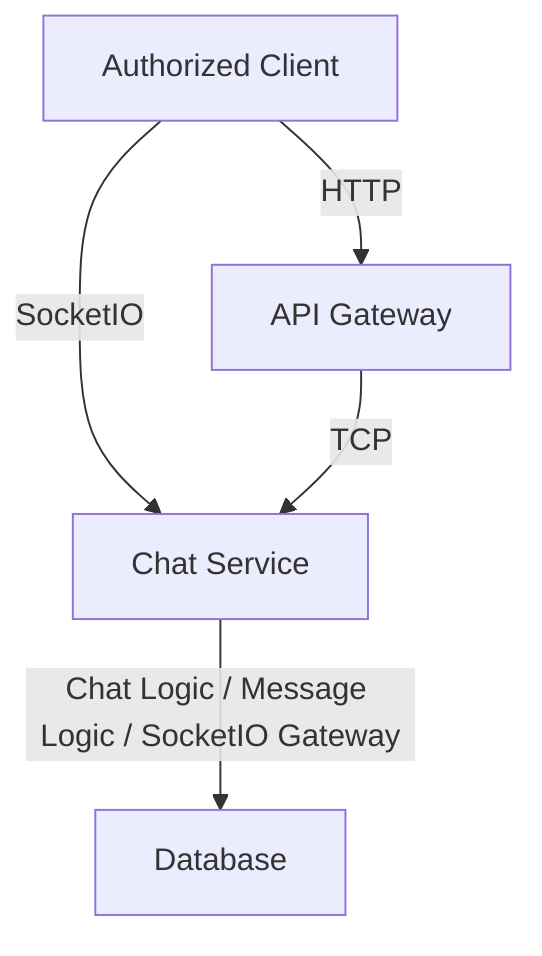

# Chat Service 
🚧 ***This service is currently under development.** Its architecture, APIs, features, and implementation details may change as development progresses.*

The Chat Service is responsible for managing chat-related functionality within the application. It communicates with the API Gateway through NestJS TCP transport and handles chat rooms, messages, and real-time communication between connected users using the [Socket.io](https://github.com/socketio/socket.IO).

## Responsibilities 
The Chat Service is responsible for:

- Manage chat rooms and participants
- Manage chat messages
- Handle Socket.IO connections and real-time communication
- Handle Socket.IO events such as joining rooms, sending messages, and leaving rooms
- Persist chat-related data
- Communicate with the API Gateway through NestJS TCP
- Handle Socket.IO connections independently from the API Gateway to isolate long-lived real-time connections and allow the Chat Service to scale independently

The Chat Service does not directly handle client-facing HTTP requests. Requests from clients are received by the API Gateway and forwarded to the Chat Service through TCP.

## Message Patterns 
The Chat Service communicates with the API Gateway using **NestJS TCP microservice transport**.

The following message patterns define the operations that can be requested by other services.

- `createRoom`
  Currently unused
- `chatsCreateGroup` [create group]
- `chatsAddGroupParticipants` [add group participants] `GROUP ADMIN ONLY`
- `chatsGetRoomsByUser` [get rooms by user]
  A controller the data of the rooms where the user is a participant.
- `chatsSelfUpdateGroupParticipant` [self update group participant]
  A controller for group participants to update their own roles in the group.
- `chatsUpdateGroupParticipants` [update group participant]
  A controler for group admins to update other participants role in the group. `GROUP ADMIN ONLY`
- `chatsUpdateGroup` [update group] `GROUP ADMIN ONLY`
- `chatsSelfDeleteGroupParticipant` [self delete group participant]
  A controller for group participants to delete themselves from the group.
- `chatsDeleteGroupParticipants` [delete group participant] `GROUP ADMIN ONLY`
- `chatsDeleteGroup` [delete group] `DELETE GROUP`
  
