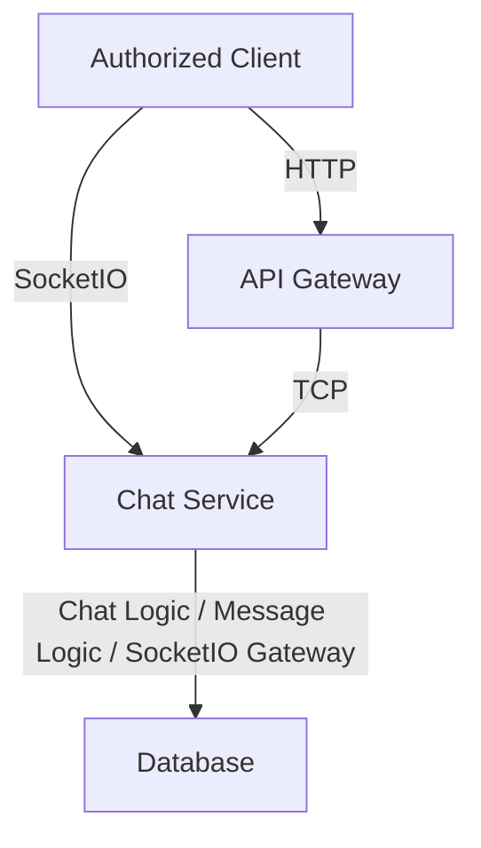
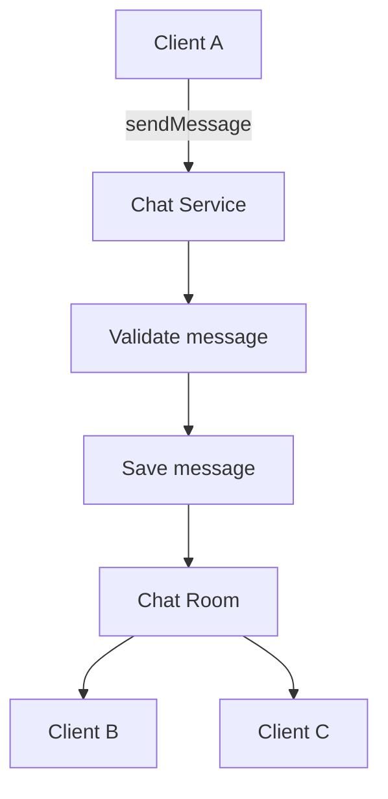
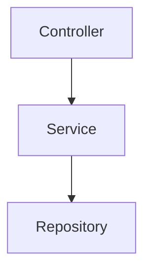
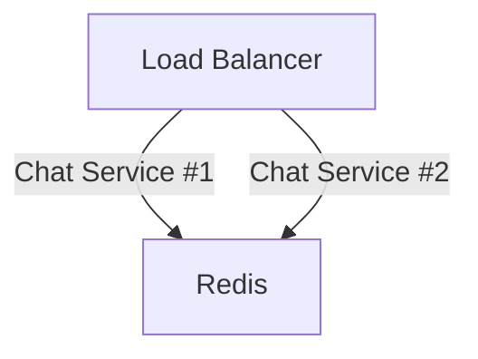

# Chat Service 
🚧 ***This service is currently under development.** Its architecture, APIs, features, and implementation details may change as development progresses.*

The Chat Service is responsible for managing chat-related functionality within the application. It communicates with the API Gateway through NestJS TCP transport and handles chat rooms, messages, and real-time communication between connected users using the [Socket.io](https://github.com/socketio/socket.IO).

## Responsibilities 
The Chat Service is responsible for:

- Manage chat rooms and participants
- Manage chat messages
- Handle .IO connections and real-time communication
- Handle [Socket.io](https://github.com/socketio/socket.IO) events such as joining rooms, sending messages, and leaving rooms
- Persist chat-related data
- Communicate with the API Gateway through NestJS TCP
- Handle [Socket.io](https://github.com/socketio/socket.IO) connections independently from the API Gateway to isolate long-lived real-time connections and allow the Chat Service to scale independently

The Chat Service does not directly handle client-facing HTTP requests. Requests from clients are received by the API Gateway and forwarded to the Chat Service through TCP.



## Message Patterns 
The Chat Service communicates with the API Gateway using **NestJS TCP microservice transport**.

The following message patterns define the operations that can be requested by other services.

- `createRoom`<br/>
  Currently unused.
- `chatsCreateGroup`<br/>
  Create a group chat.
- `chatsAddGroupParticipants`<br/>
  Add a participant to a group - `GROUP ADMIN ONLY`.
- `chatsGetRoomsByUser`<br/>
  Fetch rooms where the user is a participant.
- `chatsSelfUpdateGroupParticipant`<br/> 
  Allow a group participant to update their own role.
- `chatsUpdateGroupParticipants`<br/> 
  Update other participants' role - `GROUP ADMIN ONLY`.
- `chatsUpdateGroup`<br/> 
  Update a group chat - `GROUP ADMIN ONLY`.
- `chatsSelfDeleteGroupParticipant`<br/>
  Allow a group participant to delete themselves from the group.
- `chatsDeleteGroupParticipants`<br/>
  Delete another participant - `GROUP ADMIN ONLY`.
- `chatsDeleteGroup`<br/>
  Delete a group chat - `GROUP ADMIN ONLY`.
  
## Real-Time Events
Unlike the TCP message patterns used for inter-service communication, real-time user communication is handled through SocketIO.

For example:


## Enviromental Variables 
Each service contains its environment variables in a .env file. The .env file should be included in `.gitignore`, especially when the repository is public, to prevent sensitive information or credentials from being exposed.

The Chat Service .env file contains the following variables:
```
PORT=
GATEWAY=

CHATS_SERVICE_HOST=
CHATS_SERVICE_PORT=
CHATS_SERVICE_HTTP_PORT=

MEDIA_SERVICE_HOST=
MEDIA_SERVICE_PORT=

PROJECT_URL=

TOKEN_SECRET_KEY=
TOKEN_EXPIRES=

ENVIRONMENT=

REDIS_HOST=
REDIS_PORT=

# This was inserted by `prisma init`:
# Environment variables declared in this file are NOT automatically loaded by Prisma.
# Please add `import "dotenv/config";` to your `prisma.config.ts` file, or use the Prisma CLI with Bun
# to load environment variables from .env files: https://pris.ly/prisma-config-env-vars.

# Prisma supports the native connection string format for PostgreSQL, MySQL, SQLite, SQL Server, MongoDB and CockroachDB.
# See the documentation for all the connection string options: https://pris.ly/d/connection-strings

# The following `prisma+postgres` URL is similar to the URL produced by running a local Prisma Postgres 
# server with the `prisma dev` CLI command, when not choosing any non-default ports or settings. The API key, unlike the 
# one found in a remote Prisma Postgres URL, does not contain any sensitive information.

# DATABASE_URL=
DATABASE_URL=
```

## Installation
This project uses `npm` as its package manager.

Install the project dependencies using:

```bash
npm install
```

or:

```bash
npm i
```

### Start the App
* `npm run start` — Start the app.
* `npm run start:dev` — Start the app in development mode.
* `npm run start:debug` — Start the app in debug mode with file watching.
* `npm run start:prod` — Start the app in production mode.

### Test the App
* `npm run test` — Run unit tests.
* `npm run test:watch` — Run tests in watch mode.
* `npm run test:e2e` — Run end-to-end tests.

## Typical Module Structure
Modules generally follow this structure:

- `controller` — Handles HTTP requests and exposes the module's API endpoints.
- `service` — Contains the business logic for the module.
- `gateway` — Handles real-time communication through [Socket.io](https://github.com/socketio/socket.IO). Only used by the Chat module.
- `dto` — Defines the data transfer objects used for validating and structuring request data.
- `validation.ts` — Contains custom validation logic and validation rules for the module.
- `module` — Defines the module and its dependencies.
  
## Error Handling 
The application uses centralized error handling for consistent error responses across services. The custom `RpcException` implementation is located at `src/common/grpc-exceptions.filter.ts`

Common errors include:
- `RpcException` — Handles errors in inter-service communication using gRPC status codes.
- `PrismaClientValidationError` — Handles validation errors raised by Prisma.
- `ZodError` — Handles schema validation errors.
- `InternalServerError` — Handles unexpected internal server errors.

#### gRPC Status Code Mapping
| gRPC Code | Status | HTTP Status |
|---:|---|---:|
| `3` | `INVALID_ARGUMENT` | `400 Bad Request` |
| `5` | `NOT_FOUND` | `404 Not Found` |
| `10` | `ABORTED` | `401 Unauthorized` |
| `16` | `UNAUTHENTICATED` | `401 Unauthorized` |

For TCP communication, errors should be transformed into appropriate NestJS RPC exceptions where necessary.

Example:
```
throw new RpcException({
  statusCode: 404,
  message: 'Chat not found',
});
```

The API Gateway can then translate the error into an appropriate HTTP response for the client.

## Development Guidelines 
### 1. Keep Business Logic Inside Services
Controllers and gateways should primarily handle communication.


Avoid putting business logic directly inside controllers or gateways.

### 2. Use Zod for Validation
All incoming data is validated using Zod schemas. DTOs are used primarily to provide the structure expected by NestJS and TypeScript and are **not currently responsible for returning validation errors**.

Example:
```
export class AddGroupParticipants {
  @IsString()
  @IsNotEmpty()
  admin: string;

  @IsString()
  @IsNotEmpty()
  room_id: string;

  @IsArray()
  @ValidateNested({ each: true })
  @Type(() => ParticipantDto)
  @ArrayMinSize(1)
  participants: ParticipantDto[];
}
```

Do not rely on DTO validation for request validation. Use the corresponding Zod schema when validating incoming data.

### 3. Keep TCP Message Patterns Consistent
Message patterns should follow a consistent naming convention.

For example:
```
chatsAddGroupParticipants
chatsGetRoomsByUser
chatsSelfUpdateGroupParticipant
```

Avoid having inconsistent patterns such as:
```
chats_addGoupParticpants
chatsGetRoomsByUser
CHATSSELFUPDATEGROUPPARTICIPANT
```

### 4. Keep SocketIO Logic Separate From TCP Logic
TCP communication is primarily for service-to-service communication, while SocketIO is for real-time client communication.

Keeping these responsibilities separate makes the architecture easier to maintain.

### 5. Avoid Direct Database Access From Other Services
The Chat Service should own its chat-related data.

Other services should communicate through the Chat Service rather than directly querying its database.

## Production Considerations 
### Socket.io Scaling
If multiple Chat Service instances are running (horizontal scaling), [Socket.io](https://github.com/socketio/socket.IO) connections may be distributed across different instances.

A shared messaging mechanism such as the [Socket.io](https://github.com/socketio/socket.IO) Redis adapter may be required to synchronize events between instances.



### TCP Communication
The Chat Service should not rely on localhost in production.

For example:
```
TCP_HOST=chat-service
TCP_PORT=4001
```
***Note**: The ports shown above may differ from those specified in the original environment configuration, depending on the deployment environment.*

When deployed using Docker/Kubernetes, the service should communicate through the internal service network.

### Database
The database should be properly configured for production workloads.

Consider:
- Connection pooling
- Database indexes
- Query optimization
- Transaction handling
- Backups
- Migration management

### Authentication
JWT secrets and other credentials should **never be committed to the repository**.

Production secrets should be provided through environment variables or a dedicated secrets-management system.

### Logging
The service should provide structured logs for important events such as:

- TCP requests
- SocketIO connections
- SocketIO disconnections
- Message creation
- Database errors
- Authentication failures
- Unexpected exceptions

### Health Checks
A production deployment should expose a health-check mechanism so that the deployment platform can determine whether the Chat Service is healthy.
